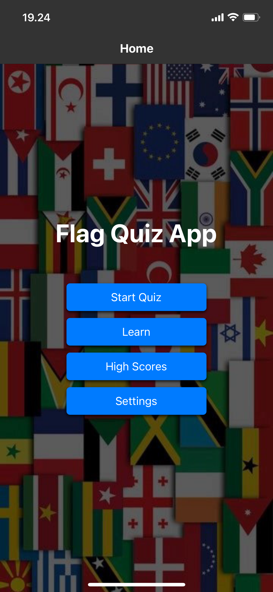
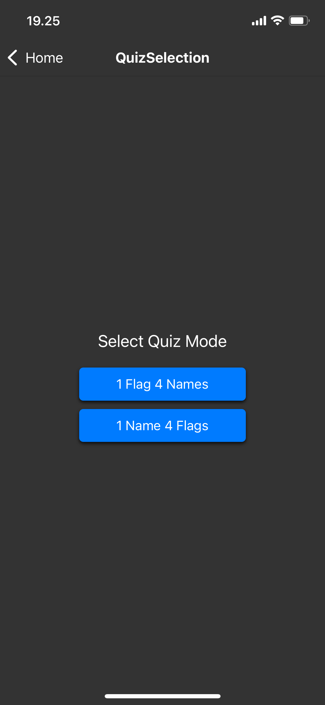
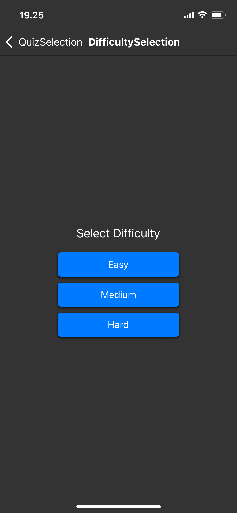
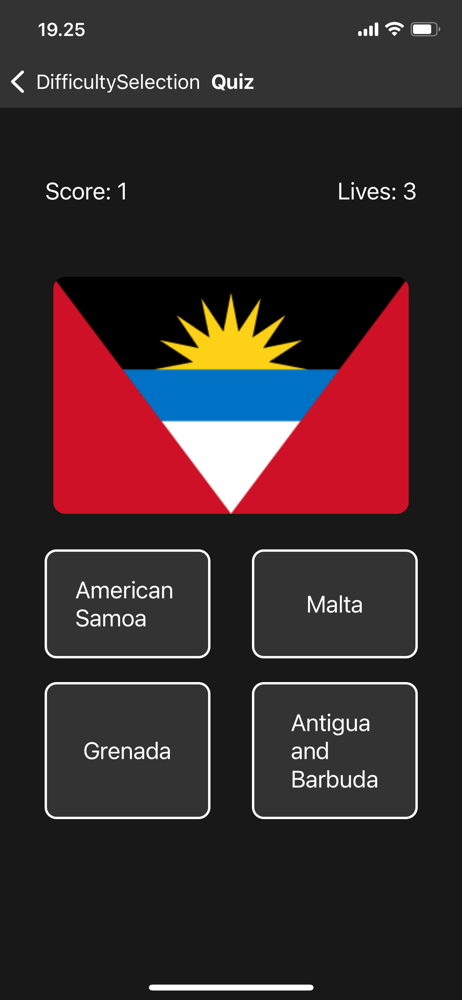
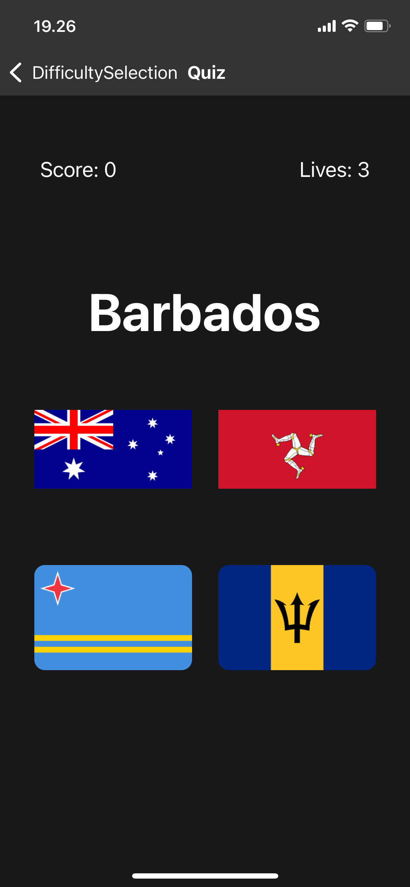
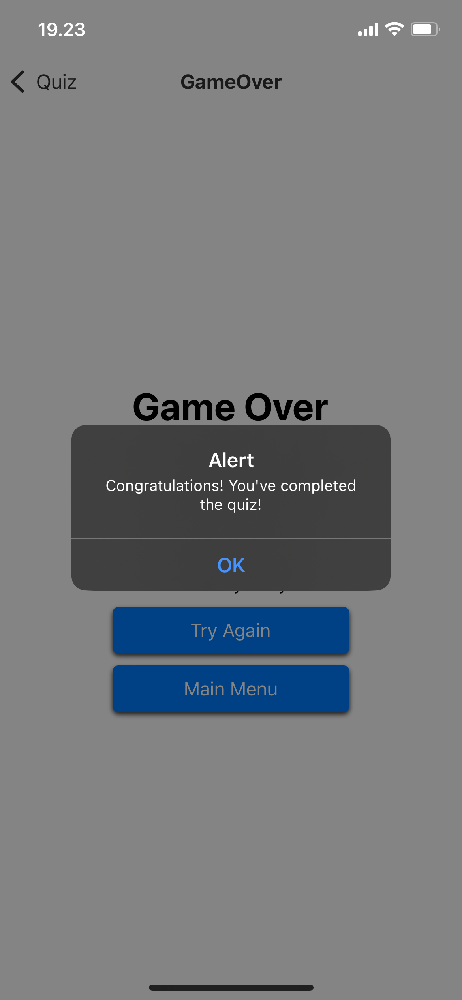
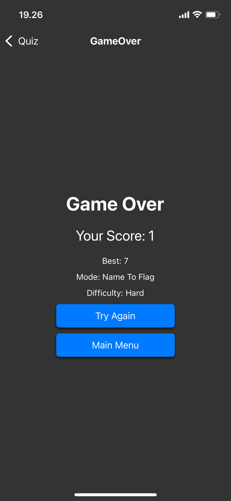
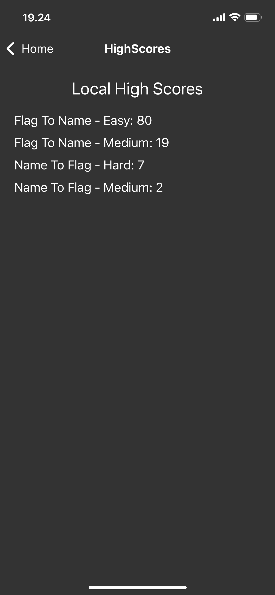
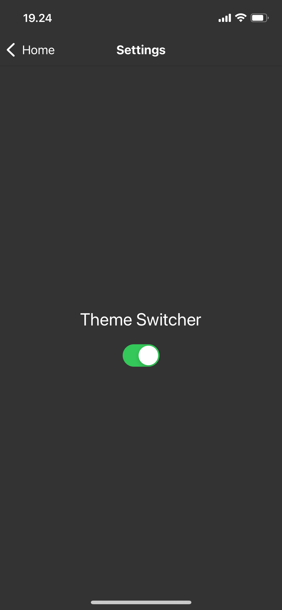
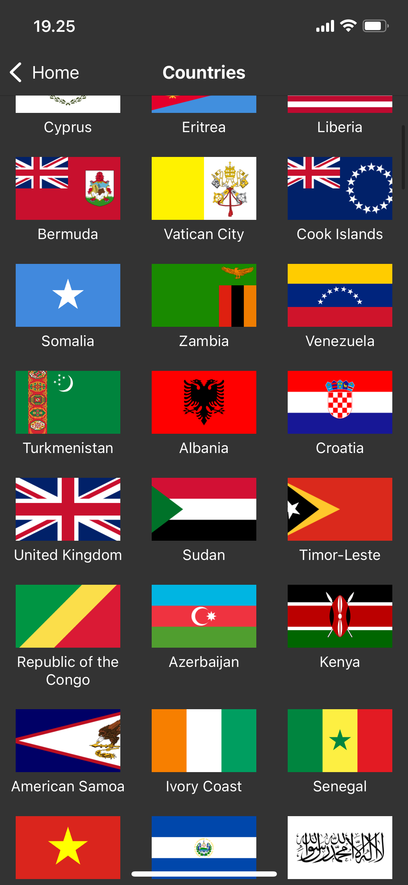

# Flag Quiz App

## Description
The Flag Quiz App is an interactive mobile application developed with React Native. It offers users a fun and educational way to learn about the flags of different countries. Users can choose between two quiz modes: "1 Flag 4 Names" or "1 Name 4 Flags", and select difficulty levels: Easy, Medium, or Hard. The app provides instant feedback with sound effects for correct and incorrect answers, enhancing the learning experience.

## Features
- Two quiz modes: "1 Flag 4 Names" and "1 Name 4 Flags"
- Three difficulty levels: Easy, Medium, Hard
- Sound effects for correct and incorrect answers
- High score tracking with AsyncStorage
- Dark and light theme support

## Installation

To run the Flag Quiz App in your own environment, follow these steps:

1. Ensure you have [Node.js](https://nodejs.org/) installed on your system.
2. Install Expo CLI by running `npm install -g expo-cli` in your terminal.
3. Clone this repository to your local machine.
4. Navigate to the project directory and install dependencies with `npm install`.
5. Start the project by running `npx expo start`. 
6. To run the app on your mobile device, download the Expo Go app from the [App Store](https://apps.apple.com/app/expo-go/id982107779) or [Google Play Store](https://play.google.com/store/apps/details?id=host.exp.exponent&referrer=www). Scan the QR code provided by the Expo developer tools with your device.

## Development

This project was developed with React Native and utilizes the Expo framework for easy setup and testing. It features the following technologies and services:

- **Expo framework**: Simplifies the setup and testing process.
- **`expo-av` library**: Manages sound effects for correct and incorrect answers.
- **AsyncStorage**: Used for persistence of high scores across sessions.
- **Rest Countries API**: Provides the flag data used in the quizzes, allowing users to learn and identify flags of different countries.

The app is designed to be both educational and entertaining. 

## Possible Future Improvements

- **UI/UX Enhancements**: Implement a more intuitive and visually appealing interface, including animations and transitions for a smoother user experience.
- **Leaderboards**: Integrate a global leaderboard system where users can compare their scores with others, encouraging competition and repeated play.
- **More Quiz Types**: Expand the quiz offerings to include more types, such as guessing the capital city from the flag or identifying the country from a geographical outline.
- **Multi-Language Support**: Add support for multiple languages, making the app accessible to a wider audience.

## Screenshots

Here are some screenshots of the Flag Quiz App in action, showcasing its features and user interface:

### Home Screen

### Quiz Mode Selection

### Difficulty Selection

### Game Mode: Flag to Name

### Game Mode: Name to Flag

### Game Completed

### Game Over Screen

### High Scores

### Settings Screen

### All Countries

